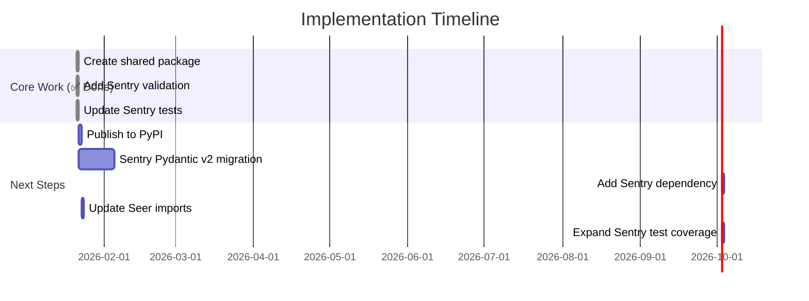

# Next Steps for Code Review Payload Validation

## Immediate Actions Required

### 1. Sentry Pydantic v2 Migration 🔴 **BLOCKER**

The shared `sentry-seer-types` package requires Pydantic v2, but Sentry currently uses Pydantic v1.

**Why This Matters**:
- Cannot import `sentry-seer-types` in Sentry until this is done
- Runtime validation code added to Sentry won't work until dependency is available

**Action Plan**:

1. **Assess Impact** (1-2 days)
   ```bash
   cd /Users/armenzg/code/11_20_sentry_seer_types
   grep -r "from pydantic import" src/ | wc -l
   # Review all Pydantic usage in Sentry
   ```

2. **Run Pydantic Migration Tool** (2-3 days)
   ```bash
   pip install bump-pydantic
   bump-pydantic src/ --diff
   ```

3. **Key Breaking Changes to Address**:
   - `Config` class → `model_config` dict
   - `@validator` → `@field_validator`
   - `@root_validator` → `@model_validator`
   - `.dict()` → `.model_dump()`
   - `.parse_obj()` → `.model_validate()`

4. **Test Thoroughly** (3-5 days)
   - Run full Sentry test suite
   - Manual testing of critical flows
   - Load testing to check performance impact

**Resources**:
- [Pydantic Migration Guide](https://docs.pydantic.dev/latest/migration/)
- [Automated Migration Tool](https://github.com/pydantic/bump-pydantic)

**Estimated Total Time**: 1-2 weeks

---

### 2. Publish `sentry-seer-types` to PyPI 📦

**Prerequisites**: None (can do this now!)

**Steps**:

1. **Create PyPI Account** (if not exists)
   - Go to https://pypi.org/account/register/

2. **Configure Publishing**:
   ```bash
   cd /Users/armenzg/code/sentry-seer-types
   .venv/bin/pip install build twine
   ```

3. **Build Package**:
   ```bash
   .venv/bin/python -m build
   # Creates dist/sentry_seer_types-0.1.0-py3-none-any.whl
   ```

4. **Test Upload to TestPyPI First**:
   ```bash
   .venv/bin/twine upload --repository testpypi dist/*
   # Verify installation works:
   pip install --index-url https://test.pypi.org/simple/ sentry-seer-types
   ```

5. **Upload to Production PyPI**:
   ```bash
   .venv/bin/twine upload dist/*
   ```

6. **Create GitHub Release**:
   - Tag: `v0.1.0`
   - Title: "Initial Release: Code Review Payload Models"
   - Description: Link to IMPLEMENTATION_SUMMARY.md

---

### 3. Add Dependency to Sentry ⏸️ **BLOCKED BY #1**

**After Pydantic v2 migration is complete:**

1. **Update `pyproject.toml`**:
   ```toml
   dependencies = [
       # ... existing deps ...
       "sentry-seer-types>=0.1.0,<0.2.0",
   ]
   ```

2. **Install and Verify**:
   ```bash
   cd /Users/armenzg/code/11_20_sentry_seer_types
   pip install sentry-seer-types
   python -c "from sentry_seer_types.codegen import CodeReviewTaskRequest; print('OK')"
   ```

3. **Run Tests**:
   ```bash
   pytest tests/sentry/seer/code_review/ -v
   ```

---

### 4. Update Seer to Use Shared Package

**Can do independently of Sentry migration!**

**Steps**:

1. **Add Dependency to Seer**:
   ```toml
   # /Users/armenzg/code/seer/pyproject.toml
   dependencies = [
       # ... existing deps ...
       "sentry-seer-types>=0.1.0,<0.2.0",
   ]
   ```

2. **Replace Model Definitions with Imports**:

   **In `/Users/armenzg/code/seer/src/seer/automation/codegen/models.py`**:
   ```python
   # REMOVE these class definitions:
   # - CodegenBaseRequest
   # - CodegenPrReviewRequest
   # - BugPredictionSpecificInformation
   # - PrReviewConfig
   
   # ADD this import:
   from sentry_seer_types.codegen import (
       CodegenBaseRequest,
       CodegenPrReviewRequest,
       BugPredictionSpecificInformation,
       PrReviewConfig,
   )
   ```

   **In `/Users/armenzg/code/seer/src/seer/automation/codegen/types.py`**:
   ```python
   # REMOVE these enum definitions:
   # - PrReviewFeature
   # - PrReviewTrigger
   # - CommentSeverity
   
   # ADD this import:
   from sentry_seer_types.types import (
       PrReviewFeature,
       PrReviewTrigger,
       CommentSeverity,
   )
   ```

   **In `/Users/armenzg/code/seer/src/seer/automation/models.py`**:
   ```python
   # REMOVE these class definitions:
   # - RepoDefinition
   # - FileChange
   # - BranchOverride
   
   # ADD this import:
   from sentry_seer_types.base import (
       RepoDefinition,
       FileChange,
       BranchOverride,
   )
   ```

3. **Update All Import Statements**:
   ```bash
   cd /Users/armenzg/code/seer
   # Find all files importing the old models
   grep -r "from seer.automation.codegen.models import.*CodegenPrReviewRequest" src/
   # Update each import to use sentry_seer_types instead
   ```

4. **Run Seer Tests**:
   ```bash
   cd /Users/armenzg/code/seer
   pytest tests/ -v
   ```

**Estimated Time**: 4-6 hours

---

### 5. Expand Test Coverage in Sentry

**Update remaining test files** to use real schema validation:

1. **`tests/sentry/seer/code_review/webhooks/test_issue_comment.py`**
   - Add `from sentry_seer_types.codegen import CodeReviewTaskRequest`
   - Replace payload assertions with `CodeReviewTaskRequest.model_validate(payload)`

2. **`tests/sentry/seer/code_review/webhooks/test_check_run.py`**
   - Validate check_run rerun payloads

3. **`tests/sentry/seer/code_review/test_webhooks.py`**
   - Add validation to error handling tests

**Pattern to Follow**:
```python
# Before (manual assertions)
payload = mock_seer.call_args[1]["payload"]
assert payload["request_type"] == "pr-review"
assert payload["data"]["pr_id"] == 42

# After (schema validation)
payload = mock_seer.call_args[1]["payload"]
validated = CodeReviewTaskRequest.model_validate(payload)
assert validated.request_type == "pr-review"
assert validated.data.pr_id == 42
```

**Estimated Time**: 2-3 hours

---

## Timeline



## Success Criteria

- [x] ✅ Shared package created with 97% test coverage
- [x] ✅ Runtime validation added to Sentry
- [x] ✅ Key Sentry tests updated to validate schemas
- [ ] 📦 Package published to PyPI
- [ ] 🔴 Sentry upgraded to Pydantic v2
- [ ] 📥 Sentry depends on `sentry-seer-types`
- [ ] 🔄 Seer imports from shared package
- [ ] ✅ All Sentry code_review tests validate schemas

## Questions?

Contact: Sentry Backend Team
Package Repo: `/Users/armenzg/code/sentry-seer-types/`
